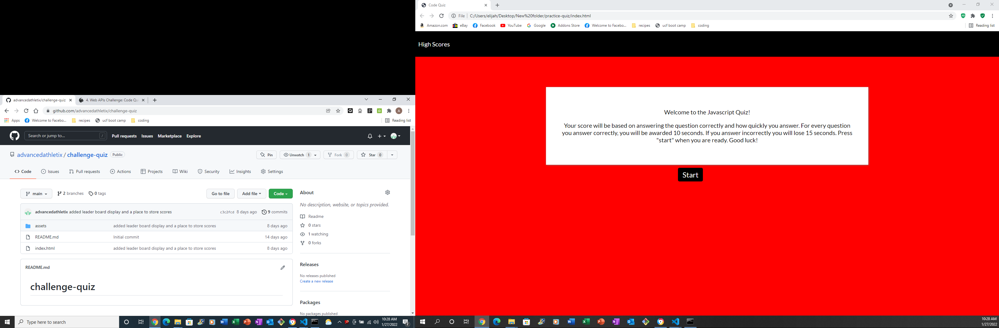

# challenge-quiz

in this challenge I created a quiz that has 5 questions

each question is multiple choice 

the quiz is timed 

if you answer the question correctly the application will add 10 seconds to your time 

if you answer the question incorrectly the application will remove 15 seconds from your time

your final score will be the amount of time you have left on your quiz 

you will then be able to add your name and it will be saved to the score board